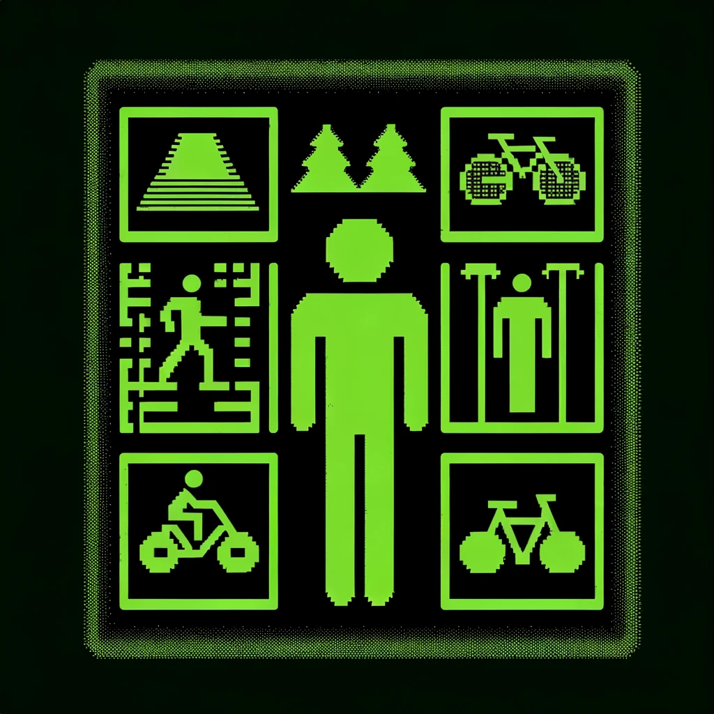
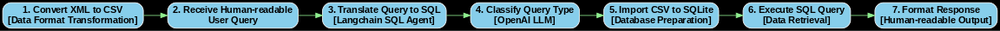
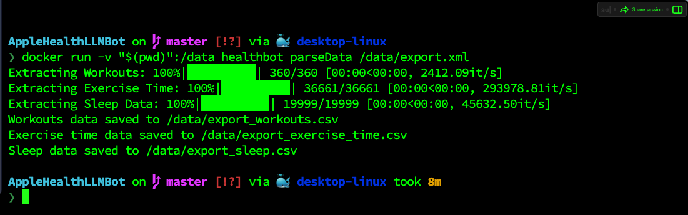

<p align="center">
  
</p>


<h1 align="center">Apple Health Bot</h1>

<p align="center">
    <em>Demystifying Your Health Data with AI</em>
</p>

<p align="center">
    
    
    
    
</p>

`Apple Health Bot` leverages OpenAI's LLM and langchain RAG over SQL to empower you with insights from your Apple Health data. 


## Table of Contents

- [Overview](#overview)
- [Features](#features)
- [Repository Structure](#repository-structure)
- [Modules](#modules)
- [Getting Started](#getting-started)
  - [Exporting Apple Health Data](#exporting-apple-health-data)
  - [System Requirements](#system-requirements)
  - [Installation](#installation)
  - [Usage](#usage)
- [Project Roadmap](#project-roadmap)
- [Contributing](#contributing)
- [License](#license)
- [Acknowledgments](#acknowledgments)

## Overview

`Apple Health Bot` works on top of your Apple Health export data, leveraging advanced RAG over SQL techniques it helps answer any relevant health query. It simplifies health data management, offering insights into workouts, sleep patterns, and exercise time through intuitive AI-driven interactions.

## Sequence Diagram
Here's a quick overview in layman's terms: This diagram illustrates how we turn your  questions into a format that our system can understand and use to fetch the exact information you're looking for, all in a way that feels like a casual conversation.





## Repository Structure

```
AppleHealthLLMBot/
├── Dockerfile
├── LICENSE
├── README.md
├── dataParser/
│   └── xmldataparser.py
├── entrypoint.sh
├── healthBot/
│   └── appleHealthBot.py
└── setup/
    └── requirements.txt
```

## Modules

- `entrypoint.sh` - Initializes script based on user commands.
- `Dockerfile` - Constructs Docker image for the Python application.
- `setup/requirements.txt` - Lists necessary project dependencies.
- `healthBot/appleHealthBot.py` - Analyzes SQL data with OpenAI and Langchain.
- `dataParser/xmldataparser.py` - Converts Apple Health XML data into CSVs for SQL database insertion.

## Getting Started

### Exporting Apple Health Data

For step-by-step instructions on exporting your data from Apple Health, see the [Apple Support guide](https://support.apple.com/guide/iphone/share-your-health-data-iph5ede58c3d/ios).

Alternatively, follow these steps:


### System Requirements

- Docker (latest version recommended)

### Installation

**From Source**

1. Clone the repository:
   ```bash
   git clone https://github.com/nk3750/apple-health-bot.git
   ```
2. Navigate to the project directory:
   ```bash
   cd apple-health-bot
   ```
3. Update the `.env` file with your OpenAI API Key:
   ```bash
   vim .env
   # Replace YOUR_OPENAI_API_KEY accordingly
   ```
4. Transfer the `export.xml` file from your Health app:
   ```bash
   cp /path/to/export.xml .
   ```

### Setup

**Docker Image Creation**

Build the Docker image:
```bash
docker build -t healthbot .
```

### Usage

**XML Parsing and CSV Conversion**

Run the parser:
```bash
docker run -v "$(pwd)":/data healthbot parseData /data/export.xml
```
*Note: This may take some time depending on your `export.xml` size. Consider taking a short break! 


This is how it should look like once the script is executed successfully.


**Start the Bot**

```
docker run -it -v "$(pwd)":/data healthbot healthBot
```
Have fun!
---

## Project Roadmap

- [ ] Fix inaccuracies with the handling of sleep data
- [ ] Enable real time data sync
- [ ] Handle complex queries involving sleep and workout
- [ ] Add testing details
- [ ] Add linting
- [ ] Add Dynamic few-shot prompt 
- [ ] Add chat history

---

## Contributing
TODO

Contributions are welcome! Here are several ways you can contribute:

- **Report Issues**: Submit bugs or feature requests.
- **Submit Pull Requests**: Review open PRs or submit your own.
- **Join the Discussions**: Share insights or ask questions.

```
